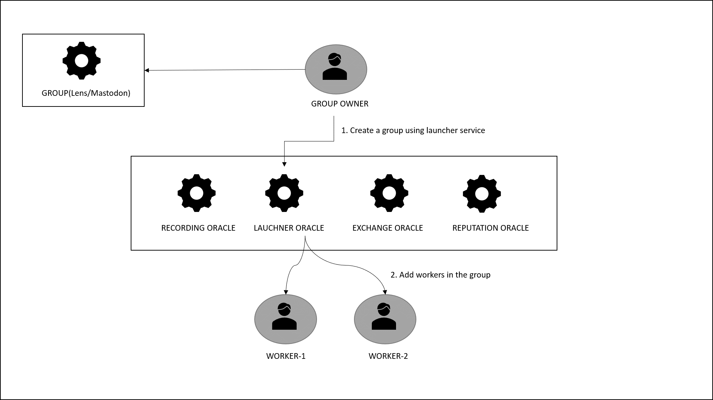
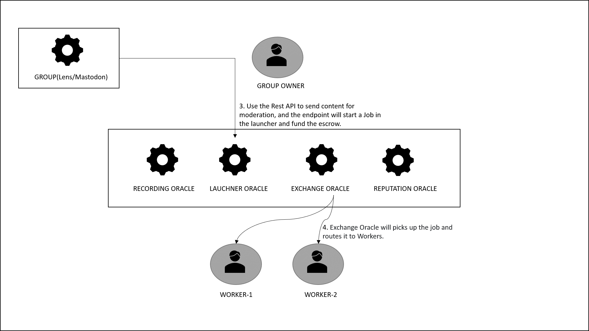
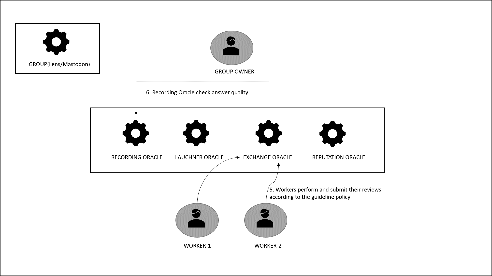
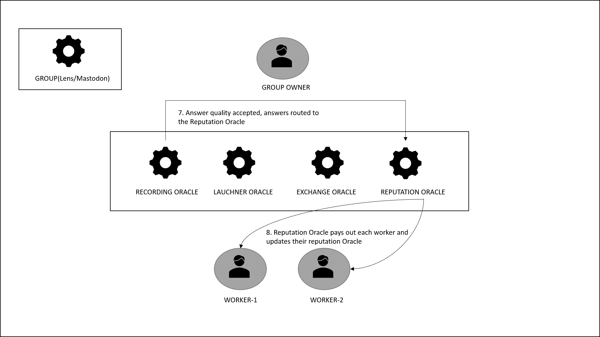

# The Linked Trust Content Moderation

Welcome to the Linked Trust Content Moderation project!  This project aims to provide a secure and efficient way to moderate content combining blockchain and [Human Protocol](https://www.humanprotocol.org/) technology, to ensure accurate and transparent content reviews. It facilitates content review tasks, enforces moderation rules defined by group owners, and ensures fair compensation for content workers. 

## Table of Contents

- [Features](#features)
- [Getting Started](#getting-started)
- [Architecture](#architecture)
- [How to run the Repute Launcher & Exchange](#how-to-run-the-repute-launcher---exchange)
- [Contributing](#contributing)
- [License](#license)
- [Acknowledgements](#acknowledgements)

## Features 

- Group setup and moderation rule definition by group owners.
- Escrow-based funding of content moderation tasks.
- Integration with a human protocol for content review.
- Content reporting by users, triggering content moderation tasks.
- On-chain job registration, routing, and settlement.


## Getting started 

### Run the dev environment from project root

```yarn dev```


## Architecture 

### Technology used 

The content moderation process takes advantage of [Human SDK](https://sdk.humanprotocol.org/) and [Human Smart Contracts](https://github.com/humanprotocol/human-protocol/tree/main/packages/core/contracts). 

### Flow 

 




## How to run the Repute Launcher & Exchange 

### Metamask Account Setup
1. Set up Accounts: In Metamask, create 3 accounts: 1 account for the **Job Creator** and 2 accounts for **Moderators** . 
2. Fund with Matic: Add Matic to the Job Creator's account using the [Polygon Scan faucet](https://faucet.polygon.technology/)
3. Token Setup:
  - Click 'Import tokens' in Metamask.
  - For ```Token Contract Address``` :  input [HMT token address on Mumbai](https://mumbai.polygonscan.com/address/0x0376D26246Eb35FF4F9924cF13E6C05fd0bD7Fb4)  ```0x0376D26246Eb35FF4F9924cF13E6C05fd0bD7Fb4```
  - Set ```Token Symbol``` as ```HMT```. 
  - Click **Add custom token**.
  - Repeat for both Moderator accounts.
4. Test HMT Acquisition:
  - Visit the Human Faucet [Human testnet Faucet](https://dashboard.humanprotocol.org/faucet)
  - Insert the Job Creator's account address.
  - Receive test HMT tokens.

### Group and Job Creation
1. Access Launcher:
  - Visit [Repute Social Launcher](https://launcher.repute.social/)
  - Sign in using the Job Creator account.
2. Create a Group 
  - Fill in the necessary group details.
  - Click 'Fund and Request Group'.
  - Note down the displayed group ID.
3. Generate API KEY and copy it.

4. Job Creation via API:
  - Navigate to the job dashboard in the Launcher.
  - Select **View Details** for your new group.
  - Click **Create Job** and choose **Open Swagger**.
  - In Swagger UI, use the /groups/{groupId}/jobs API.
  - Copy your API KEY in Authorize. 
  - Click **Try it out** and replace {groupId} with your actual group ID.
  - Hit **Execute** to create the job.
5. Adding Workers to Group:
  - Back in the Launcher, inside the group details, click 'Add Worker'.
  - Add both Moderator accounts (Worker 1 & Worker 2) to this group.

### Moderator App Review
1. Moderator Review:
  - Open the [Moderator app](https://exchange.repute.social/)
  - Sign in as Worker 1.
  - Choose your group from the dropdown.
  - View the job, then mark as ```Risk``` or ```No risk```.
2. Second Moderator Review:
  - Logout as Worker 1.
  - Sign in as Worker 2.
  - Repeat the review steps.
3. Verify Token Receipt:
  - Ensure both Worker 1 and Worker 2 received HMTs in their Metamask wallets.

## Contributing

We welcome contributions to improve and expand this project. To contribute:

1. Fork the repository.
2. Create a new branch.
3. Make your enhancements or fixes.
4. Submit a pull request, describing your changes.

## License

This project is licensed under the [MIT License](https://opensource.org/license/mit/)

## Acknowledgements

We would like to acknowledge the generous support of [HUMAN Protocol](https://humanprotocol.org) in completing this work and in support of the team at [Repute.Social](https://repute.social) in putting it to use!
